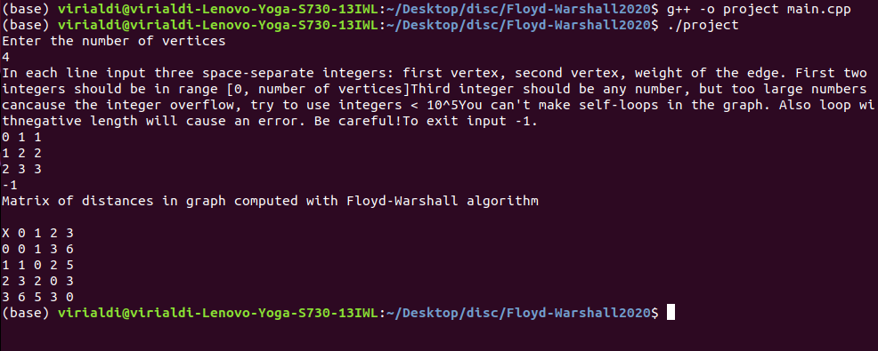

# Floyd-Warshall2020 С++

## Installation and usage

* Download the main.cpp file
> $ git clone https://github.com/ViriAldi/Floyd-Warshall2020

* Compile the file
> $ g++ -o project main.cpp

* Run the compiled file
> $ ./project

* Follow input instructions

> Note: if you have other compiler use it's name on the place of g++. If you don't have C++ compiler then install it or try some of online compilers. For example this one is pretty good: https://www.onlinegdb.com/online_c++_compiler

### Installation and usage example

## Credits

Fedynyak Volodymyr, Michael Brodiuk
